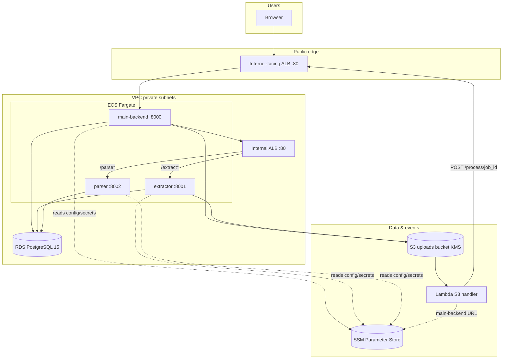

# StackNine Invoice Processor

A microservices application that accepts invoice PDF uploads, extracts structured data from them, and presents the results through a web interface.

This repository contains the **application source** and **Terraform** for deploying it on **AWS** (ECS Fargate, RDS, S3, Lambda, ALB, etc.).

---

## What the application does

Users sign in with an email address, upload an invoice PDF, and see extracted fields (invoice number, vendor, date, total, line items) on a results page. The pipeline is **asynchronous**: after upload, the user is redirected to a page that polls until the job is **done**.

---

## Architecture overview

### Logical application (three services + database)

| Service | Port | Role |
|---------|------|------|
| `main-backend` | 8000 | Web UI (HTML), uploads, orchestrates `/process` |
| `extractor` | 8001 | Downloads PDF (S3 or local path), extracts text with **pdfplumber**, stores raw text in PostgreSQL |
| `parser` | 8002 | Reads raw text from PostgreSQL, parses fields with regex, writes structured invoice + line items |

Schema: `db/init.sql` (tables: `jobs`, `raw_text`, `invoices`, `line_items`).



**Design choices (short):**

- **Public ALB only** for browser HTTP; **internal ALB** for service-to-service paths `/extract` and `/parse` on the same host as `EXTRACTOR_URL` / `PARSER_URL` base URL.
- **S3** for durable PDF storage on Fargate; **Lambda** bridges **S3 ObjectCreated** → **`POST /process/{job_id}`** so upload returns quickly (`ENV=production` in `main-backend`).
- **SSM** holds DB settings, bucket name, service URLs, and ALB URL for Lambda (`/stacknine/...` paths; see table below).
- **RDS** holds application data; endpoint is stored in SSM (`/stacknine/db-host`). Tasks run in private subnets with **NAT** for outbound AWS APIs.

### Request flow (production on AWS)

```text
1. Browser → Public ALB → main-backend
2. Upload: main-backend writes S3 key {job_id}/{filename}.pdf, inserts job (pending)
3. S3 event → Lambda(job_id from key) → POST {ALB}/process/{job_id}
4. main-backend → Internal ALB/extract → extractor → DB (raw text)
              → Internal ALB/parse  → parser    → DB (invoice, status done)
5. Browser polls /results/{job_id} until done
```

### Local development

Uses **Docker Compose**: PostgreSQL + three services with `ENV=local`; upload triggers **`POST /process/{job_id}`** on localhost instead of Lambda.

```bash
docker compose up --build
```

| Service | URL |
|---------|-----|
| Web UI | http://localhost:8000 |
| Extractor | http://localhost:8001 |
| Parser | http://localhost:8002 |
| PostgreSQL | localhost:5433 |

Tests (from repo root):

```bash
cd extractor   && python -m pytest tests/
cd parser      && python -m pytest tests/
cd main-backend && python -m pytest tests/
```

Sample PDFs: `sample-invoices/`.

---

## AWS deployment (Terraform)

Infrastructure lives under **`terraform/`**. Naming follows the hackathon pattern: `hackthon-k9-intern-<your-name>-<resource>` (see `TASK-1.md`).

### Prerequisites

- AWS account, IAM Identity Center or IAM user able to create VPC, RDS, ECS, IAM, etc.
- **Terraform** `>= 1.5`, **AWS CLI**, **Docker**
- **S3 bucket + DynamoDB table** for remote state (or comment out `backend "s3"` in `terraform/versions.tf` for local state only)

### Configure

1. Copy and edit **`terraform/terraform.tfvars`**:

   - `name_prefix` — e.g. `hackthon-k9-intern-alice`
   - `github_repository` — **must match** the GitHub repo that runs Actions, e.g. `kubenine-ayoob/hackathon-project`, or OIDC will fail with `AssumeRoleWithWebIdentity`.

2. **GitHub** → repository **Settings → Secrets and variables → Actions**  
   - `AWS_ROLE_ARN` = value of `terraform output github_deploy_role_arn` after first successful apply.

### Bootstrap order

1. Create state bucket + lock table (if using S3 backend), then `terraform init`.
2. `terraform apply` (from laptop or CI with admin-capable credentials).
3. **Build and push** images from **repository root** (not `terraform/`):

   ```bash
   aws ecr get-login-password --region us-east-1 | docker login --username AWS --password-stdin <ACCOUNT>.dkr.ecr.us-east-1.amazonaws.com
   # use terraform output ecr_repositories for URIs
   for svc in main-backend extractor parser; do
     docker build -t <PREFIX>-$svc:latest ./$svc
     docker tag <PREFIX>-$svc:latest <ECR_URI>/latest
     docker push <ECR_URI>/latest
   done
   ```

4. Force new ECS deployment so tasks pull `:latest` (or rely on `.github/workflows/deploy.yaml` after OIDC works).

### Useful outputs

| Output | Purpose |
|--------|---------|
| `public_alb_url` | Browser entry URL |
| `github_deploy_role_arn` | GitHub secret `AWS_ROLE_ARN` |
| `ecr_repositories` | Docker push targets |

### CI/CD (GitHub Actions)

Workflow: **`.github/workflows/deploy.yaml`** (on push to `main`):

- OIDC → `configure-aws-credentials`
- `terraform init` / `apply`
- Build/push three images to ECR
- `aws ecs update-service --force-new-deployment`

**Important:** If `terraform apply` in CI runs with a **wrong** `github_repository`, it **updates the IAM trust policy** and the **next** workflow can fail OIDC even if the previous run “succeeded.” Keep `github_repository` exactly equal to `owner/repo` on GitHub.

### SSM parameters (runtime)

| Parameter | Type | Used by |
|-----------|------|---------|
| `/stacknine/db-host` | String | ECS tasks |
| `/stacknine/db-name` | String | ECS tasks |
| `/stacknine/db-user` | String | ECS tasks |
| `/stacknine/db-password` | SecureString | ECS tasks |
| `/stacknine/s3-bucket` | String | main-backend, extractor |
| `/stacknine/extractor-url` | String | main-backend (internal ALB base URL) |
| `/stacknine/parser-url` | String | main-backend (internal ALB base URL) |
| `/stacknine/main-backend-url` | String | Lambda (`lambda/handler.py`) |

Lambda code path is fixed to **`/stacknine/main-backend-url`**; keep that name or change the Lambda and IAM together.

---

## Repository layout

```text
├── db/init.sql                 # PostgreSQL schema
├── main-backend/               # FastAPI UI + orchestration
├── extractor/                  # PDF → text
├── parser/                     # Text → structured invoice
├── lambda/handler.py           # S3 → POST /process/{job_id}
├── sample-invoices/            # Test PDFs
├── docker-compose.yml          # Local stack
├── terraform/                  # AWS infrastructure (VPC, ECS, RDS, …)
├── .github/workflows/deploy.yaml
├── TASK-1.md                   # Hackathon brief
└── README.md
```

---

## Security guardrails (AWS)

- S3 uploads bucket: **private**, **SSE-KMS** (or equivalent), block public access.
- Secrets in **SSM SecureString**; ECS injects via **task `secrets`**, not plaintext in images.
- **No public IPs** on Fargate tasks; **RDS** not publicly accessible.
- **IAM**: separate task roles per service where possible; scope ARNs in policies for production hardening.
- **ALB**: inbound HTTP(S) restricted as appropriate; ECS accepts traffic from ALB security groups only.

---

## Troubleshooting

| Symptom | Likely cause |
|---------|----------------|
| GitHub `AssumeRoleWithWebIdentity` denied | `github_repository` in `terraform.tfvars` ≠ actual `owner/repo`, or `AWS_ROLE_ARN` wrong. Run `terraform apply` after fixing trust. |
| Job stuck **pending** after upload | Lambda not invoked, Lambda error, or SSM **`main-backend-url`** wrong; check Lambda CloudWatch logs and S3 event notification. |
| `terraform init` S3 backend error | State bucket or DynamoDB lock table missing in the backend region. |
| ECS **CannotPullContainerError** | Images not pushed to ECR or wrong repo/tag. |

---

## References

- **`TASK-1.md`** — full hackathon requirements, scoring, and naming convention.

---

## License / ownership

Hackathon / internship project; adjust license and ownership per your organization.
