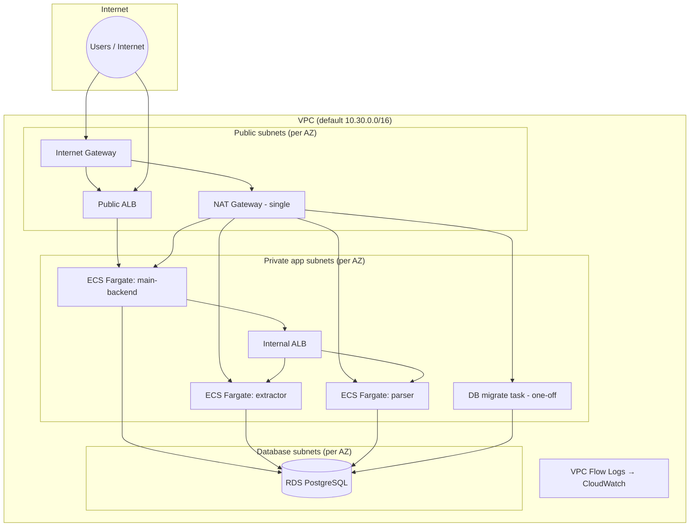
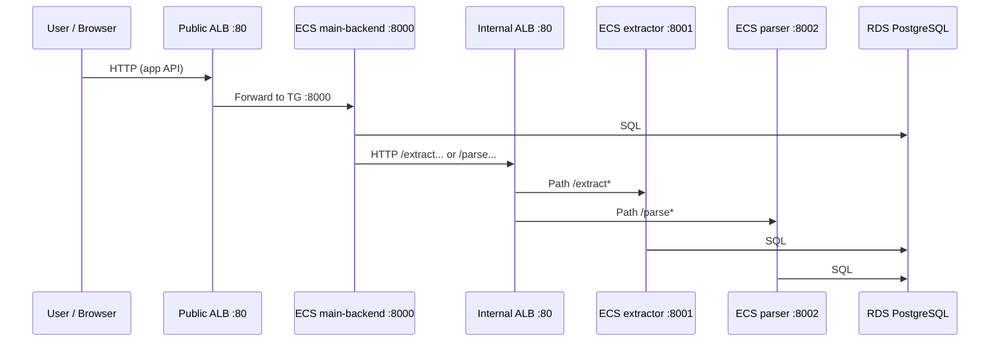
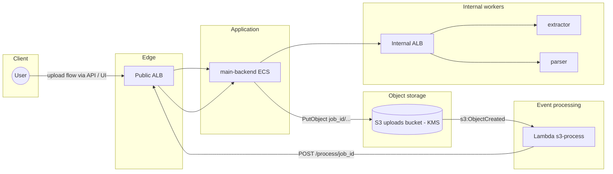
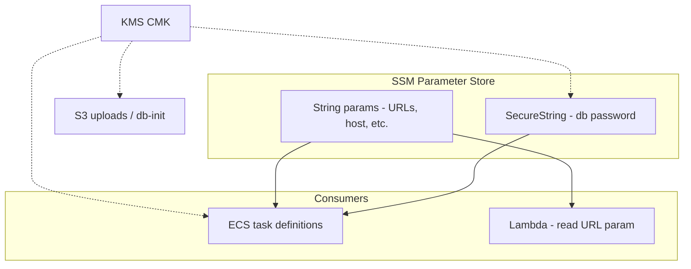
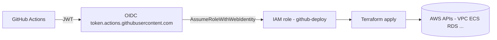
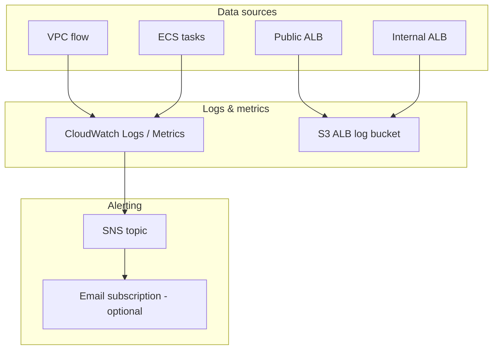

# Terraform — StackNine on AWS

This folder is the **infrastructure-as-code** for the StackNine invoice-processing app. Terraform creates the VPC, load balancers, **three ECS Fargate services**, RDS PostgreSQL, S3 buckets, ECR, KMS, SSM parameters, a **Lambda** triggered by uploads, CloudWatch alarms, SNS, and optionally a **GitHub Actions** deploy role.

**If you are new here:** read [Start here (newcomers)](#start-here-newcomers), then skim the diagrams — they show *where* each piece lives and *how* traffic flows.

---

## Start here (newcomers)

| Step | What to do |
|------|------------|
| 1 | Install **Terraform 1.9.x** and the **AWS CLI**. Log in (`aws sso login` or keys) and set `AWS_PROFILE` if you use SSO. |
| 2 | Create an **S3 bucket** and **DynamoDB lock table** for remote state (Terraform cannot create these in the same first run). Match names with `backend "s3"` in `versions.tf`. |
| 3 | Copy `envs/dev.tfvars` and set `name_prefix`, `github_repository`, `tfstate_bucket`, `tflock_table`, etc. |
| 4 | From this directory: `terraform init` → `terraform plan -var-file=envs/dev.tfvars` → `terraform apply -var-file=envs/dev.tfvars`. |
| 5 | **Push Docker images** to ECR (repos are empty after apply). Without images, ECS tasks will fail health checks. |
| 6 | Open `terraform output public_alb_url` for the app URL. |

The sections below explain **what** is built, **why** the layout looks like this, and **how** to operate and troubleshoot it.

---

## Table of contents

1. [What gets created (quick reference)](#what-gets-created-quick-reference)
2. [Architecture diagrams](#architecture-diagrams)
   - [VPC & network](#1-vpc--network-architecture)
   - [Traffic: user → ALBs → ECS → RDS](#2-traffic-user--albs--ecs--rds)
   - [File upload: S3 → Lambda → main-backend](#3-file-upload-s3--lambda--main-backend)
   - [Secrets & configuration (SSM, KMS)](#4-secrets--configuration-ssm-kms)
   - [CI/CD: GitHub Actions → AWS](#5-cicd-github-actions--aws)
   - [Observability](#6-observability)
3. [Prerequisites](#prerequisites)
4. [Repository layout (this folder)](#repository-layout-this-folder)
5. [Configure your environment](#configure-your-environment)
6. [Bootstrap remote state (first time only)](#bootstrap-remote-state-first-time-only)
7. [Day-to-day commands](#day-to-day-commands)
8. [After apply: Docker images & ECS](#after-apply-docker-images--ecs)
9. [Outputs reference](#outputs-reference)
10. [Modules](#modules)
11. [Security defaults](#security-defaults)
12. [Operational gotchas (read this)](#operational-gotchas-read-this)
13. [State and `moved.tf`](#state-and-movedtf)
14. [Destroying the stack](#destroying-the-stack)
15. [Troubleshooting](#troubleshooting)
16. [Known improvements](#known-improvements)

---

## What gets created (quick reference)

| Area | Resources |
|------|-----------|
| **Network** | VPC, **public** / **private (app)** / **database** subnets per AZ, **single NAT gateway**, **VPC Flow Logs** |
| **Security** | Security groups for public ALB, internal ALB, ECS tasks, RDS, db-migrate task |
| **Load balancing** | **Internet** ALB → **main-backend** (:8000); **internal** ALB → **extractor** (:8001) / **parser** (:8002) via path rules |
| **Compute** | ECS cluster (Container Insights), **3 Fargate services** |
| **Registry** | **ECR** repos: `main-backend`, `extractor`, `parser` (KMS-encrypted) |
| **Data** | **RDS PostgreSQL** (encrypted), **S3**: uploads, db-init SQL object, **ALB access logs** |
| **Secrets** | **SSM Parameter Store** (URLs, DB connection info; **SecureString** for DB password) |
| **Crypto** | **KMS** CMK for ECR, S3 (uploads/init), SSM SecureStrings |
| **Automation** | **Lambda** on **S3 ObjectCreated** → HTTP **POST** to main-backend **`/process/{job_id}`** |
| **Observability** | CloudWatch **alarms**, **SNS** topic (optional email) |
| **CI/CD** | Optional **GitHub OIDC** provider + **IAM role** for `terraform apply` from Actions |

Default VPC CIDR is **`10.30.0.0/16`** (`variables.tf`); subnets are carved with `cidrsubnet` so **public**, **private-app**, and **private-data** tiers each get **one /20-style block per AZ** (see `network.tf`).

---

## Architecture diagrams

Use these diagrams together: the **VPC** diagram shows *placement*; **traffic** and **file upload** show *application behavior*.

### 1. VPC & network architecture

High-level layout: **internet** reaches only the **public** subnet tier (public ALB + NAT). **ECS tasks** and the **internal ALB** sit in **private app** subnets. **RDS** uses **database** subnets (no default route to the internet). This stack uses **one NAT gateway** for outbound trafficfrom private subnets (cost-friendly for dev; prod may want one NAT per AZ).



**Legend (beginner-friendly)**

- **Internet gateway**: front door for **inbound** HTTP to the public ALB and **return** traffic.
- **NAT gateway**: lets **private** subnets open **outbound** connections (e.g. pull images, AWS APIs) without accepting direct inbound from the internet.
- **Public ALB**: **listener :80** → **main-backend** target group on container port **8000**.
- **Internal ALB**: **private** only; **:80** with rules **`/extract*`** → extractor **8001**, **`/parse*`** → parser **8002**.
- **Database subnets**: RDS subnets; not used for application tasks.

---

### 2. Traffic: user → ALBs → ECS → RDS

Typical **synchronous** path: browser hits the **public** ALB; **main-backend** orchestrates work and may call **extractor** / **parser** via the **internal** ALB.



Health checks: both ALBs use **`GET /health`** expecting **200** (`loadbalancing.tf`).

---

### 3. File upload: S3 → Lambda → main-backend

After the app stores an object in the **uploads** bucket (key layout includes **`job_id`** as the first path segment), **S3 event notification** invokes **Lambda**. Lambda reads the **main-backend base URL** (from env / SSM) and sends **HTTP POST** to `{main_backend_url}/process/{job_id}` so the backend can queue or run pipeline steps (extract/parse).



**Notes**

- Lambda needs **`aws_lambda_permission`** allowing **s3.amazonaws.com** to invoke; the **bucket notification** `depends_on` that permission (`lambda.tf`).
- **main-backend** is not “directly” inside the private VPC from Lambda’s perspective: Lambda uses the **public** ALB URL (or whatever URL is stored in SSM), so that URL must be reachable from the Lambda **run environment** (typically public HTTP or VPC-attached Lambda if you change design later).

---

### 4. Secrets & configuration (SSM, KMS)

ECS tasks receive DB host, user, URLs, and bucket name as **secrets** from **SSM**; the DB password is a **SecureString** encrypted with the stack **KMS** key. **ECR** and **KMS-encrypted S3** buckets use the same CMK where configured.



---

### 5. CI/CD: GitHub Actions → AWS

GitHub Actions assumes an **IAM role** via **OIDC** (`pipeline.tf`). That role is scoped to your **`github_repository`** and branch. It can read/write **Terraform state** (S3 + DynamoDB) and apply changes per the attached **apply** policy (service-scoped, not raw `*/*`).



Set **`AWS_ROLE_ARN`** in GitHub secrets to the output **`github_deploy_role_arn`**. If the account already has the GitHub OIDC provider, set **`create_github_oidc_provider = false`** in tfvars.

---

### 6. Observability

**ALB access logs** land in a dedicated **S3** bucket (SSE-S3). **VPC Flow Logs** and **ECS** container logs go to **CloudWatch Logs**. **CloudWatch alarms** can publish to **SNS** (topic uses AWS-managed encryption suitable for alarm delivery).



---

**Image tags:** ECS task definitions use `var.image_tags` (per service). Defaults in `envs/dev.tfvars` are often `:latest`; CI should pass **git SHA** tags for reproducible deploys.

---

## Prerequisites

| Requirement | Notes |
|-------------|--------|
| **Terraform** | **1.9.x** (`required_version = "~> 1.9"` in `versions.tf`). Run `terraform version`. |
| **AWS account** | Permissions for VPC, ECS, RDS, IAM, Lambda, etc. |
| **AWS credentials** | `aws configure` or **SSO**: `aws sso login` then `export AWS_PROFILE=...` |
| **AWS CLI** | ECR login, `aws ecs run-task` (db-migration), debugging SGs and tasks |

---

## Repository layout (this folder)

```text
terraform/
├── versions.tf        # Terraform + provider versions; S3 backend block
├── providers.tf       # AWS provider; default_tags from locals
├── variables.tf       # Input variables (see envs/*.tfvars)
├── locals.tf          # Tags, SSM param map inputs, service list
├── data.tf            # Availability zones, caller identity, ELB service account
├── outputs.tf         # ALB URL, ECR URLs, role ARN, etc.
│
├── network.tf         # VPC module + flow logs
├── security.tf        # Security groups (standalone rules for ECS ingress)
├── kms.tf             # CMK for S3/ECR/SSM
├── storage.tf         # S3 buckets + ECR
├── database.tf        # RDS + random password + db-migration module
├── loadbalancing.tf   # Public + internal ALB modules
├── ecs.tf             # ECS cluster + for_each ecs-service module
├── secrets.tf         # SSM parameters
├── lambda.tf          # Lambda + permission + S3 notification
├── observability.tf   # SNS + CloudWatch alarms
├── pipeline.tf        # GitHub OIDC + deploy IAM policies
├── moved.tf           # Optional state moves; remove when plan is clean
│
├── envs/
│   ├── dev.tfvars
│   └── prod.tfvars.example
│
└── modules/
    ├── ecs-service/   # Fargate service wrapper
    └── db-migration/  # One-shot Fargate + init.sql
```

---

## Configure your environment

1. Start from `envs/dev.tfvars` or `prod.tfvars.example`.
2. Set at minimum:
   - **`name_prefix`** — lowercase; used in ECR repo names and (with account id) S3 bucket names (`storage.tf`).
   - **`github_repository`** — `owner/repo` for OIDC (must match the repo running Actions).
   - **`tfstate_bucket`** / **`tflock_table`** — must match **`versions.tf`** `backend "s3"`.
3. If your account **already** has the GitHub OIDC provider: **`create_github_oidc_provider = false`**.

---

## Bootstrap remote state (first time only)

`versions.tf` uses a **remote backend** (S3 + DynamoDB lock). Those resources **cannot** be created by this same Terraform state on the very first run. Create them once, then `terraform init`.

**Checklist**

- **S3:** bucket exists, **versioning** on, **public access blocked**, **encryption** on.
- **DynamoDB:** table with partition key **`LockID`** (String), **on-demand** billing, **same region** as backend.

If `terraform init` fails with **NoSuchBucket**, fix the bucket name in AWS or update `backend "s3"` in `versions.tf`.

---

## Day-to-day commands

Run from **`terraform/`** (or use `-chdir=terraform`).

```bash
cd terraform

terraform init
terraform plan -var-file=envs/dev.tfvars
terraform apply -var-file=envs/dev.tfvars

# CI-style
terraform apply -auto-approve -var-file=envs/dev.tfvars

# Hygiene
terraform fmt -recursive
terraform validate
```

**Pin images from CI** (recommended):

```bash
terraform apply -var-file=envs/dev.tfvars \
  -var='image_tags={main-backend="YOUR_GIT_SHA",extractor="YOUR_GIT_SHA",parser="YOUR_GIT_SHA"}'
```

---

## After apply: Docker images & ECS

Terraform creates **empty ECR repositories**. Build and push images before tasks stay healthy.

1. `terraform output -json ecr_repositories` (or read URLs printed after apply).
2. From the **repository root** (parent of `terraform/`): ECR login, `docker build`, `docker push` for each service. Image URI pattern:
   - `{{account}}.dkr.ecr.{{region}}.amazonaws.com/{{name_prefix}}-{{service}}:tag`
3. Update **`image_tags`** and re-apply, or **`aws ecs update-service --force-new-deployment`** if you rely on `:latest`.

The **`.github/workflows/deploy.yaml`** pipeline automates ECR + apply. The workflow’s **`PREFIX` / naming** must match **`name_prefix`** in `envs/dev.tfvars`.

---

## Outputs reference

| Output | Purpose |
|--------|---------|
| `public_alb_url` | User-facing HTTP URL |
| `internal_alb_dns_name` | Private ALB DNS (also referenced via SSM for service-to-service calls) |
| `ecr_repositories` | Push Docker images here |
| `github_deploy_role_arn` | GitHub Actions **`AWS_ROLE_ARN`** |
| `ecs_cluster_name` | `aws ecs ...` CLI |
| `rds_endpoint` | Sensitive; host:port |
| `kms_key_arn` | Stack CMK |
| `ops_sns_topic_arn` | Alarm notifications |

```bash
terraform output
terraform output -raw public_alb_url
```

---

## Modules

### `modules/ecs-service`

Wrapper around **`terraform-aws-modules/ecs/aws//modules/service`**. Notable options:

- Load balancer target group attachment, CPU/memory, desired count  
- **`health_check_grace_period_seconds`** (slow starts)  
- **`readonly_root_filesystem`** — **extractor** sets **`false`** in `ecs.tf` when the app needs **`/tmp`** (e.g. temp PDF downloads)

### `modules/db-migration`

Runs **`../db/init.sql`** once using a **Fargate** task; `null_resource` with **`local-exec`** calls `aws ecs run-task` (AWS CLI required where you run **`apply`**). DB password is injected via task **secrets**, not the shell command line.

---

## Security defaults

- **S3:** block public access, versioning, **KMS** on uploads/init (ALB log bucket uses **SSE-S3** as required for ELB logging).  
- **RDS:** encrypted with stack CMK; see `database.tf` for PI and optional IAM DB auth.  
- **KMS** key rotation enabled where applicable.  
- **VPC Flow Logs** to CloudWatch.  
- **ALB access logs** to dedicated S3 + lifecycle.  
- **SSM** DB password as **SecureString**.  
- **GitHub deploy role:** scoped IAM policies (not account-wide admin).  
- **ECS:** read-only root by default; **extractor** is the documented exception.

---

## Operational gotchas (read this)

1. **Security groups:** Avoid mixing **inline** `ingress` on an SG with separate **`aws_security_group_rule`** for the **same** SG — rules can flap or disappear. This stack uses **standalone rules** for ECS task ingress.  
2. **Internal ALB → extractor/parser:** Tasks must allow **8001** / **8002** from the **internal ALB** security group.  
3. **Extractor and `/tmp`:** Read-only root conflicts with downloading to **`/tmp`** unless you add a writable mount — see **`ecs.tf`**.  
4. **S3 names:** Globally unique; buckets use **`{name_prefix}-{account_id}-...`**.  
5. **RDS password** is in Terraform state (random + SSM). For stricter posture consider RDS **managed master password** + Secrets Manager.

---

## State and `moved.tf`

**`moved { }`** blocks remap old resource addresses after refactors so Terraform does not destroy real AWS objects by accident.

When **`terraform plan`** shows **no** unexpected moves/destroys, you may **delete `moved.tf`** and confirm **no changes** on the next plan.

---

## Destroying the stack

```bash
terraform destroy -var-file=envs/dev.tfvars
```

**Caution:** dev-oriented settings like **`force_destroy`** on buckets and **`skip_final_snapshot`** on RDS can **permanently** delete data. Review `database.tf` and `storage.tf` before destroying shared environments.

---

## Troubleshooting

| Symptom | What to check |
|---------|----------------|
| `Unsupported Terraform Core version` | Install Terraform **1.9.x**. |
| `NoSuchBucket` on `init` | Create state bucket + lock table, or fix `backend "s3"`. |
| `InvalidClientTokenId` | SSO login + **`export AWS_PROFILE`**. |
| ECS **ELB health check** failures | SGs, **`/health`**, grace period, **readonly root** + **`/tmp`**. |
| Jobs stuck **pending** | Lambda logs, **`POST /process/{id}`**, extractor/parser logs. |
| `BucketAlreadyExists` | Change **`name_prefix`** or naming. |
| GitHub cannot assume role | **`github_repository`** / branch, **`AWS_ROLE_ARN`**, OIDC trust. |

---

## Known improvements

- **HTTPS:** ACM + :443 + redirect on public ALB.  
- **RDS:** `manage_master_user_password` and app integration with Secrets Manager.  
- **Migrations:** Replace `null_resource` + local CLI with CodeBuild or a documented one-off task runbook.

For **application** behavior and **local Docker** usage, see the root [`../README.md`](../README.md).
